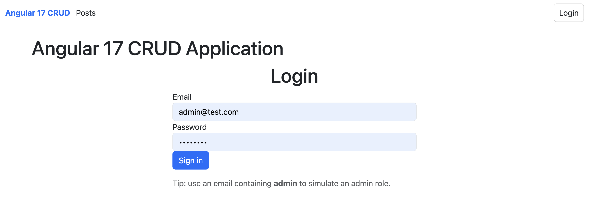
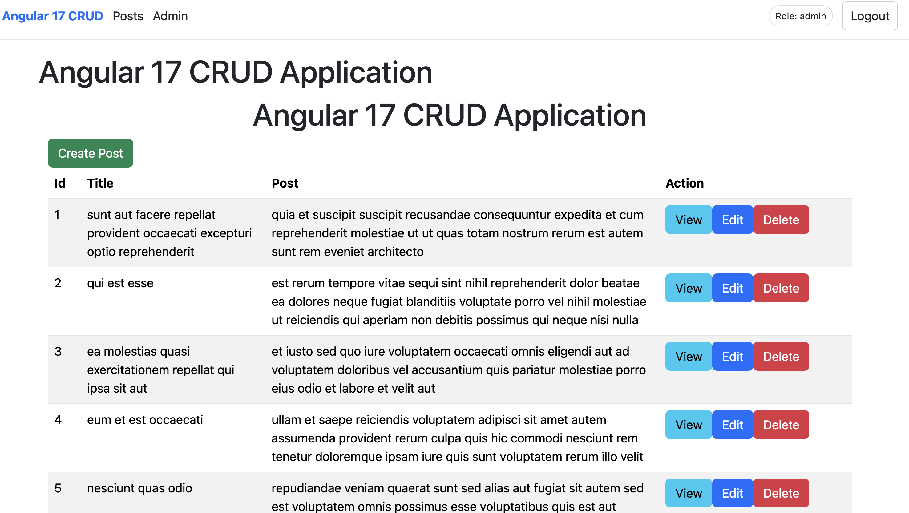

Angular 17 CRUD Application

## Test Coverage

A feature-based Angular 17 application demonstrating authentication, protected routing, data resolvers, HTTP interceptors, reactive forms, and a layered automated testing strategy.

This project was built to explore how modern Angular applications are structured and tested beyond a basic CRUD demo.

⸻

🚀 Features
	•	Angular 17 standalone components
	•	Feature-based project structure
	•	Authentication flow with protected routes
	•	Guest, auth, and role-based route guards
	•	Route resolvers for data preloading
	•	Global loading and error HTTP interceptors
	•	Reactive forms with validation
	•	Reusable form components
	•	Angular Signals for local UI state
	•	Toast notifications for success and error feedback

⸻

🧪 Testing Strategy

The project includes a layered automated testing approach:

Unit tests
	•	Services (HTTP requests tested with HttpTestingController)
	•	Guards
	•	Resolvers
	•	Interceptors

Component tests
	•	Presentational components
	•	Container/page components using stubs

Router tests
	•	Smoke navigation tests
	•	Full router integration tests using RouterTestingHarness

CI
	•	GitHub Actions runs the test suite automatically on push and pull requests.

⸻

🏗 Architecture Highlights

The application follows a feature-based architecture, grouping related components, services, and models by domain.

Example Structure
src/app
  core/
  shared/
  features/
    auth/
    posts/
      components/
      pages/
      services/
      resolvers/
      models/

📚 What This Project Demonstrates
	•	Angular routing and navigation architecture
	•	Authentication and role-based access control
	•	Resolver-based data loading
	•	Interceptor-based HTTP request handling
	•	Reactive form patterns
	•	Testable component architecture
	•	Angular testing patterns across multiple layers
	•	Continuous Integration for frontend applications

⸻

⚙️ Tech Stack
	•	Angular 17
	•	TypeScript
	•	RxJS
	•	Jasmine / Karma
	•	Angular Testing Utilities
	•	GitHub Actions CI
:::

## Architecture Diagram

                Router
                   │
        ┌──────────┴──────────┐
        │                     │
     Guards               Resolvers
        │                     │
        └──────────┬──────────┘
                   │
              Page Containers
        (Index / Create / Edit)
                   │
        ┌──────────┴──────────┐
        │                     │
   Presentational        Services
      Components         (API)
        │                     │
        └──────────┬──────────┘
                   │
              Interceptors
           (Loading / Error)
                   │
                 API

Guards protects routes
Resolvers preload data
Interceptors manage HTTP state
Container components orchestrate logic
Presentational components handle UI

## Testing Strategy

The application uses a layered Angular testing approach.

### Unit Tests
- Services tested with `HttpTestingController`
- Guards and resolvers tested with `runInInjectionContext`

### Component Tests
- Presentational components tested with shallow tests
- Container components tested using component stubs

### Router Tests
- Smoke navigation tests
- Full route integration tests using `RouterTestingHarness`

### Continuous Integration
GitHub Actions runs the Angular test suite on every push.

## Project Structure

src/app
  core/
    interceptors/
    services/

  shared/
    components/
    services/

  features/
    auth/
      guards/
      services/
      pages/

    posts/
      components/
      pages/
      services/
      resolvers/
      models/

  tests/
    helpers/
    stubs/

    Guards There are two guards an authguard protects the post/index page from unauthorised access. If you browse to here without a token you will be prompted to the /auth/login page to login. And the guestGuard prevents logged in users from seeing guest pages.

    Resolvers preload the post data before the page is loaded and these are monitored by the hasError and isLoading variables.

    Interceptors sit between the API and the smart component and they effectively carry out the error and loading portions of error handling. The component calls the API and if this results in errors or loading errors they are intercepted by these to handle the errors before being returned to the application.

    Container components orchestrate logic by communicating with the API to find the ID or grab a collection from the API.

    Presentational components handle UI and are only concerned with passing inputs and outputs and rendering UI components to the screen.

## Application Screens
Login Page

Post List

Create Post

Forbidden
 
